# A brief study of Graphs


## 1.Intro:

 Recently, I have found out about the amazing topic of Graphs. One of the questions that I had when I started studiying was: to which field Graphs belong?
 Is it **Mathematics**? That would make sense if, for example, we bring ourselves back to Euler's time, when the Genius proved that it was impossible to visit every place in Königsberg crossing each of its seven bridges only once.[1](https://www.geeksforgeeks.org/paths-travel-nodes-using-edgeseven-bridges-konigsberg/).
 Perhaps **Computer Science**? Graphs are themselves a data structure, and even a program workflow can be modelled with a graph (2)(https://www.youtube.com/watch?v=cWIeTMklzNg).
> Other examples can be found in **Medicine**, **Physics**, in **Molecular Biology** for **Drug Desing** (3)(https://arxiv.org/pdf/1812.08434.pdf), depicting **social networks** (facebook, linkedin), the **World Wide Web**... (4)(https://www.youtube.com/watch?v=gXgEDyodOJU).

So they have shown to be a powerful tool for modelling a truly wide range of things. 
> But how are we supposed to treat them, mathematically speaking?

Well, a formal definition could be as follows (6)(http://math.uchicago.edu/~may/REU2012/REUPapers/JiangJ.pdf):

> a graph is an ordered pair G=G(V,E) of sets such as 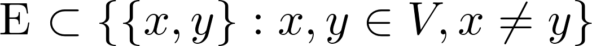

In this post, I will present some of properties of fundamental Graphs. I won't derivate the results I will be presenting. The interested reader will find any of the resources that drived me to write this post in the Further Reading section.
> I found specially usefull (5)(https://www.geeksforgeeks.org/graph-data-structure-and-algorithms/) and (6)(http://math.uchicago.edu/~may/REU2012/REUPapers/JiangJ.pdf), so if you, like me, are discovering the world of graphs, make sure you check them out.

Here we will discuss *easy* graphs: only undirected (every edge is bidirectional), simple (no auto-nodes) and finite Graphs.

## 2. Graph class
Let's consider the following **Python 3** class for a Graph. It will store the graph nodes in an **Adjancy list**, which is the most efficient way to store a Graph in terms of computing complexity [$\textit{(4)}$](https://www.youtube.com/watch?v=gXgEDyodOJU).
>  The Adjacency List of a Graph is a data structure containing **each of the Graph nodes** with a respective **lists of the neighbour nodes**.
Guess what data structure it is? Yes... it's a Python Dict

> So the Graph Class stores a Graph as an Adjacency List, allows addition of edges or nodes to the graph, and drawing it. For the drawing part the *networkx* (7)(https://networkx.github.io/) python package has been used.


```python
import numpy as np
import matplotlib.pyplot as plt
import networkx as nx
```


```python
class Graph(object):
    
    def __init__(self, adjList=None):
        if adjList == None:
            adjList = {}
        self.__adjList = adjList
        self.__tempvertices=[]
        self.__autoedges=[]

    def getVertices(self):
        return list(self.__adjList.keys())
    
    def getEdges(self): return self.__edgesList()
    
    def getAdjList(self): return self.__adjList

    def addVertex(self, vertex):
        if vertex not in self.__adjList:
            self.__adjList[vertex] = []
            self.__tempvertices.append(vertex)

    def addEdge(self, edge):
        vertex1,vertex2=edge[0],edge[1]
        if vertex1 in self.__adjList:
            self.__adjList[vertex1].append(vertex2)
        else:
            self.__adjList[vertex1] = [vertex2]
    
    def __edgesList(self):
        return [(vertex,vertices[i]) for vertex,vertices in self.__adjList.items() for i in range(len(vertices))]
    
    def draw(self):
        G=nx.Graph()
        G.add_node(0)
        edges=self.__edgesList()
        [G.add_edge(*edge) for edge in edges]
        [G.add_node(edge) for edge in self.__tempvertices]
        nx.draw(G,with_labels=True)
        plt.draw()
        plt.show()

    def getAdjencyMatrix(self):
        v=len(self.__adjList)
        A=np.zeros((v,v),int)
        for i in range(v):
            for j,v_row in self.__adjList.items():
                if v_row==[]: continue
                A[i,j]=int(i in v_row)
        return A
    
    def getLaplacianMatrix(self):
        v=len(self.__adjList)
        L=np.zeros((v,v),int)
        for v,vs in self.__adjList.items():
            if vs==[]: continue
            for w in vs:
                L[v,w],L[v,v]=-1,len(vs)
        return L
```

## 3. Graph Matrix Representations
Besides the Adjacency List, there exist other representations, that can be computationally expensive, but are interesting for studying fundamental properties of Graphs.$$$$
One of them is the **Adjacency Matrix**, in which each row represent a node and the entries that are 1 instead 0 stand for the neighbour node positions with respect to this node.

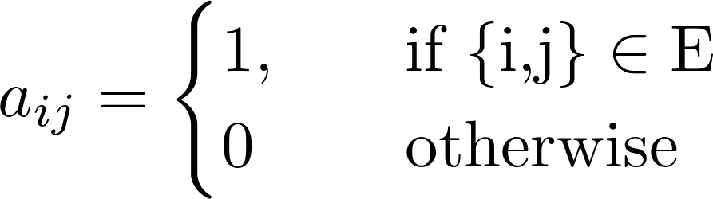

> Note that, if the graph has no *autonodes*, then all diagonal entries in its Adjacency Matrix are equal to zero.

Another representation of a Graph is its **Laplacian Matrix**. The diagonal entries of the Laplacian Matrix are equal to the node degree, i.e., how many edges are connecting to the node represented at this position in the diagonal.

The other entries in the Laplacian Matrix are equal to -1 when they row-column position correspond to the nodes forming an edge in the graph.

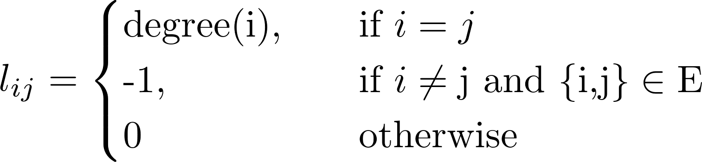

> The Laplacian Matrix verifies that **adding up all entries within a row or a column the result is zero**. This is an important property from which meanful information about the Laplacian eigenvalues is derived.

> Perhaps you thought about it already, **does not the Adjency Matrix of a Graph depend on the order in which we decide to name the nodes?**$$$$

In fact, it does, and it turns out that, depending on the order in which graph nodes are labeled, the number of different adjency matrices for a given graph $G$ is given by: $$\frac{v!}{|Aut(G)|}$$ $$$$ where $v$ is the number of nodes, $Aut(G)$ is the automorphism group of the Graph, and $|Aut(G)|$ is the cardinality (number of elements) of this group [$\textit{(7)}$](http://mathworld.wolfram.com/AdjacencyMatrix.html)

The different Matrix representation of different order labeled graphs are just matrices in which some rows / columns have been permuted, so by the properties of determinants it follows that they have common eigenvalue basis. See the example below:


```python
G1_edges=[(0,1),(0,2),(1,0),(1,2),(2,0),(2,1),(2,3),(3,2)]
G2_edges=[(3,1),(3,2),(2,3),(2,1),(1,2),(1,3),(1,0),(0,1)]
G1,G2=Graph(),Graph()
[G1.addEdge(edge) for edge in G1_edges]
[G2.addEdge(edge) for edge in G2_edges]
G1.draw()
G2.draw()
A1,A2=G1.getAdjencyMatrix(),G2.getAdjencyMatrix()
print('El mismo grafico tiene varias matrices de adyacencia. \n En este caso A1=\n{0}\n y A2=\n{1}\n \
      son dos de ellas'.format(A1,A2))
```


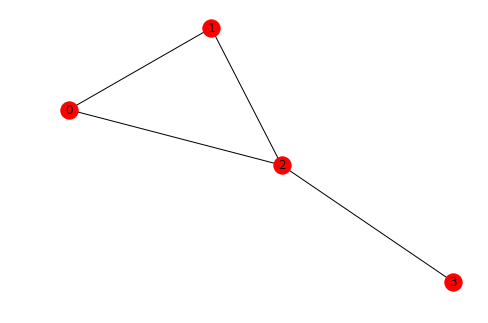


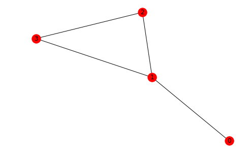


    El mismo grafico tiene varias matrices de adyacencia. 
     En este caso A1=
    [[0 1 1 0]
     [1 0 1 0]
     [1 1 0 1]
     [0 0 1 0]]
     y A2=
    [[0 1 0 0]
     [1 0 1 1]
     [0 1 0 1]
     [0 1 1 0]]
     son dos de ellas
    

Do these matrices share a diagonal basis?


```python
vs1,ws1=np.linalg.eig(A1)
vs2,ws2=np.linalg.eig(A2)
vs1,vs2=np.around(vs1,2),np.around(vs2,2)
ws1,ws2=np.around(ws1,2),np.around(ws2,2)
print("A1 has eigenvalues: {0}, {1}, {2}, {3}\
\nA2 has eigenvalues: {4}, {5}, {6}, {7} \n\
all them sum up to zero.".format(vs1[0],vs1[1],vs1[2],vs1[3],vs2[0],vs2[1],vs2[2],vs2[3]))
print("\n A1 eigenvectors: {0},{1},{2},{3} \n\
A2 egienvectors: {3}, {4}, {5}, {7}".format(ws1[0],ws1[1],ws1[2],ws1[3],ws2[0],ws2[1],ws2[2],ws2[3]))
```

    A1 has eigenvalues: 2.17, 0.31, -1.0, -1.48
    A2 has eigenvalues: -1.48, 0.31, 2.17, -1.0 
    all them sum up to zero.
    
     A1 eigenvectors: [ 0.52  0.37 -0.71 -0.3 ],[ 0.52  0.37  0.71 -0.3 ],[ 0.61 -0.25 -0.    0.75],[ 0.28 -0.82  0.   -0.51] 
    A2 egienvectors: [ 0.28 -0.82  0.   -0.51], [ 0.51  0.82 -0.28 -0.  ], [-0.75  0.25 -0.61  0.  ], [ 0.3  -0.37 -0.52  0.71]
    

## 4.Some fundamental properties of some fundamental Graphs
We will study three important Graphs:
* The Complete Graph **K_n**
* The Cicle Graph **K_n**
* The Path Graph **C_n**
It can be proven that, given an undirected graph, one of its eigenvalues is always zero.(6)(http://math.uchicago.edu/~may/REU2012/REUPapers/JiangJ.pdf).

#### 4.1 Complete Graph:
In a complete graph, every node is connected with all others. In other words, if the graph has n nodes, every node in the graph is of degree n-1, so it's adjacency Matrix is:
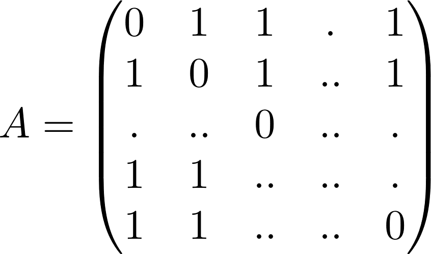,
and its Laplacian Matrix
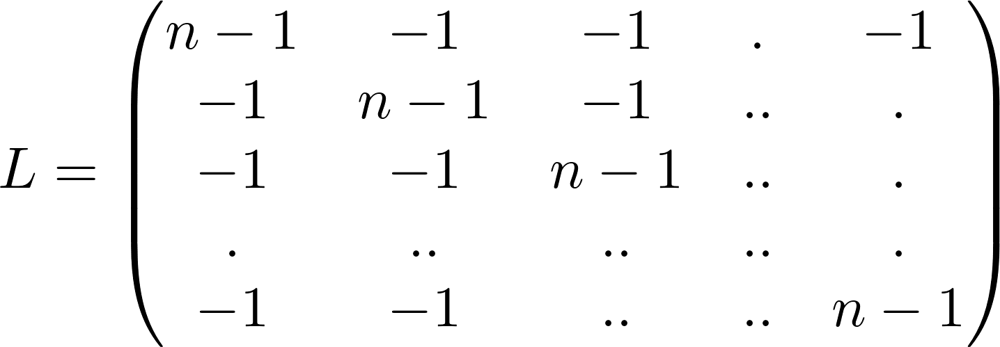
> Below there is an example of **K_4**


```python
K=Graph({0:[1,2,3],1:[0,2,3],2:[0,1,3],3:[0,1,2]})
K.draw()
Ak=K.getAdjencyMatrix()
Lk=K.getLaplacianMatrix()
print("Adejency Matrix: \n {0} \n \n Laplacian: \n {1}".format(Ak,Lk))
```


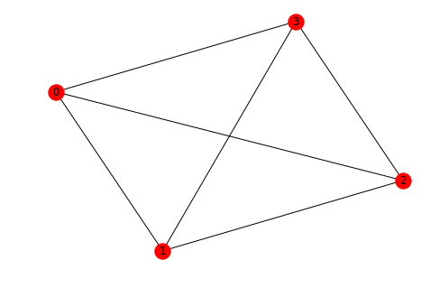


    Adejency Matrix: 
     [[0 1 1 1]
     [1 0 1 1]
     [1 1 0 1]
     [1 1 1 0]] 
     
     Laplacian: 
     [[ 3 -1 -1 -1]
     [-1  3 -1 -1]
     [-1 -1  3 -1]
     [-1 -1 -1  3]]
    

It can be proven that, given an undirected graph, one of its eigenvalues is always zero.(6)(http://math.uchicago.edu/~may/REU2012/REUPapers/JiangJ.pdf). 

For the **complete Graph**, its Laplacian eigenvalue +0* has multiplicity *1* and it has only another eigenvalue of value **n** and multiplicity **n-1**


```python
vs_Lk,ws_Lk=np.linalg.eig(Lk)
vs_Lk,ws_Lk=np.around(vs_Lk,2),np.around(ws_Lk,2)
print( " Eigen values: {0}".format(vs_Lk))
```

     Eigen values: [ 4. -0.  4.  4.]
    

#### 4.2 Cicle Graph:
In a cicle graph, every node is connected with the previous and next node, and the last one with the first one. In other words, every node in the graph is of degree 2, so its adjency Matrix is:
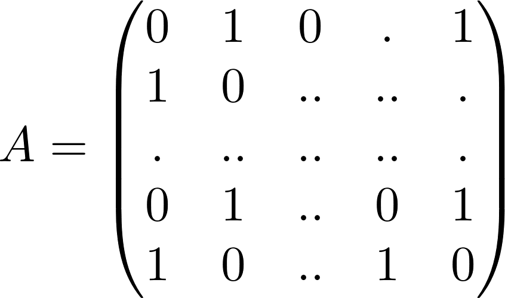
and its Laplacian Matrix is
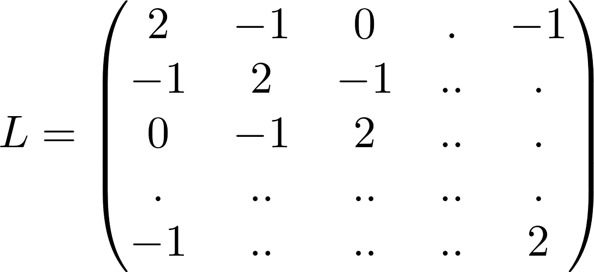
> Below there is an example of **C_4**


```python
C=Graph({0:[1,3],1:[0,2],2:[1,3],3:[0,2]})
C.draw()
Ac=C.getAdjencyMatrix()
Lc=C.getLaplacianMatrix()

print("Adejency Matrix: \n {0} \n Laplacian: \n {1}".format(Ac,Lc))
```


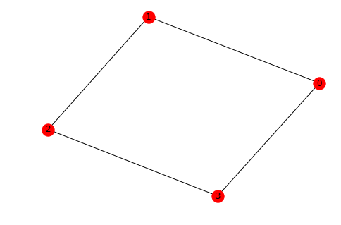


    Adejency Matrix: 
     [[0 1 0 1]
     [1 0 1 0]
     [0 1 0 1]
     [1 0 1 0]] 
     Laplacian: 
     [[ 2 -1  0 -1]
     [-1  2 -1  0]
     [ 0 -1  2 -1]
     [-1  0 -1  2]]
    

For the **cicle Graph**, the Laplacian eigenvalues are given by the formula 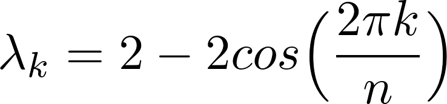
con **k=0,1...n/2**

Let's see that it works for **C_4**


```python
vs_Lc,ws_Lc=np.linalg.eig(Lc)
vs_Lc,ws_Lc=np.around(vs_Lc,2),np.around(ws_Lc,2)
print("Eigenvalues: {0}".format(vs_Lc))
```

    Eigenvalues: [-0.  2.  4.  2.]
    

#### 4.3 Path Graph:
It is pretty much like the Cicle Graph but with the differnece that its end and starting nodes are not connected. It can be seen as an *open* cicle Graph. Their Adjency and Laplacian matrices are like the ones of Cicle Graph but having $0$ instead of $1 (-1)$ in the entries $a_{1n} (l_{1n}), a_{n1}, (l_{n1})$:
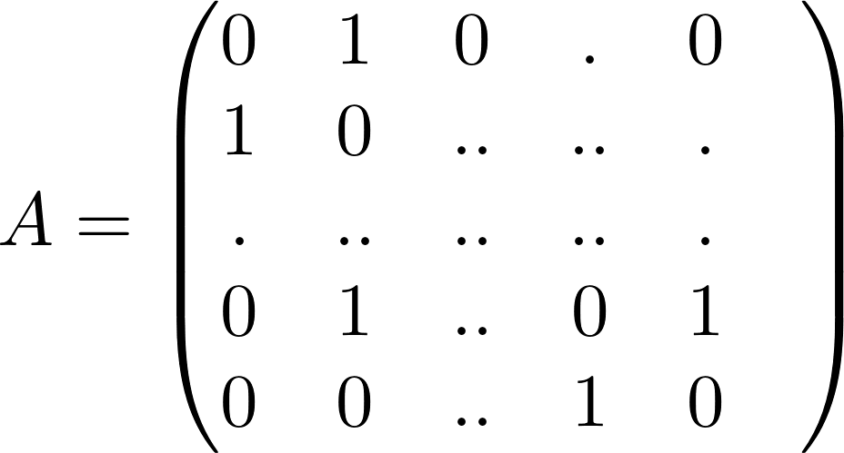
and it's Laplacian Matrix is
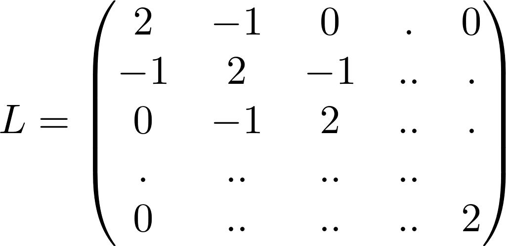

> Below there is an example of **P_4**


```python
P=Graph({0:[1],1:[0,2],2:[1,3],3:[2]})
P.draw()
Ap=P.getAdjencyMatrix()
Lp=P.getLaplacianMatrix()
print("Adjency Matrix: \n {0} \n Laplacian: \n {1} ".format(Ap,Lp))
```


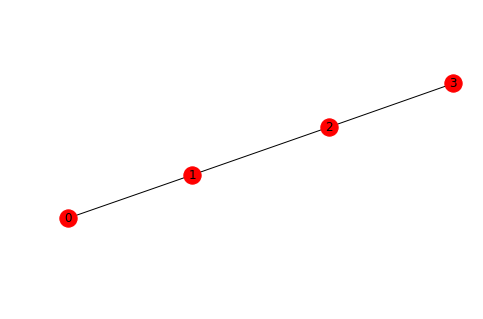


    Adjency Matrix: 
     [[0 1 0 0]
     [1 0 1 0]
     [0 1 0 1]
     [0 0 1 0]] 
     Laplacian: 
     [[ 1 -1  0  0]
     [-1  2 -1  0]
     [ 0 -1  2 -1]
     [ 0  0 -1  1]] 
    

In the case of the **Path Graph**, its eigenvalues follow the formula (6)(http://math.uchicago.edu/~may/REU2012/REUPapers/JiangJ.pdf):

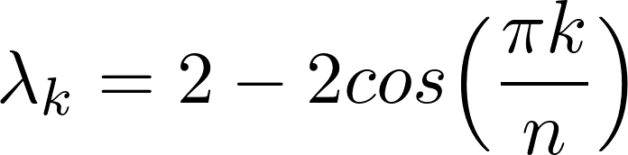
con **k=0,1...n-1**

Bellow there is the example for $P_{4}$


```python
vs_Lp,ws_Lp=np.linalg.eig(Lp)
vs_Lp,ws_Lp=np.around(vs_Lp,2),np.around(ws_Lp,2)
print("Eigenvalues: {0}".format(vs_Lp))
```

    Eigenvalues: [3.41 2.   0.   0.59]
    

## 5. Conclussion

Studiying the spectral propreties of the matricial Graph representations is usefull to obtain information about the *connectivity of the Graph*. Further study can show relations between the dimension of the associated eigenspaces and the connectivity of the Graph. Also, it is possible to set bounds to the expected eigenvalues for certain families of Graphs (6)(http://math.uchicago.edu/~may/REU2012/REUPapers/JiangJ.pdf).$$$$
However, for very big Graphs, the number of neighbours of each node may be small compared to the total number of nodes, and therefore, a matricial representation of such Graph would have many more zeros than non-zero entries. These are called spare matrices, and computing them (i.e. diagonalizing them) is very inneficient (2)(https://www.youtube.com/watch?v=cWIeTMklzNg).

## 6. Further Reading
* *(1)* [Graph Data Structure And Algorithms - Geeks for Geeks](https://www.geeksforgeeks.org/paths-travel-nodes-using-edgeseven-bridges-konigsberg/)
* *(2)* [Graph neural networks: Variations and applications - 12:00 ](https://www.youtube.com/watch?v=cWIeTMklzNg)
* *(3)* [Graph neural networks: a review of Methods and Applications ](https://arxiv.org/pdf/1812.08434.pdf)
* *(4)* [My code School - Data Structures - Introduction to Graphs](https://www.youtube.com/watch?v=gXgEDyodOJU)
* *(5)* [Graph Data Structure And Algorithms - Geeks for Geeks](https://www.geeksforgeeks.org/graph-data-structure-and-algorithms/)
* *(6)* [An Introduction to Spectral Graph Theory Jiaqi Jiang University of Chicago](http://math.uchicago.edu/~may/REU2012/REUPapers/JiangJ.pdf)
* *(6)* [MathWorld Wolfram](http://mathworld.wolfram.com/AdjacencyMatrix.html)
* *(6)* [Networkx Github Repo](https://networkx.github.io/)
